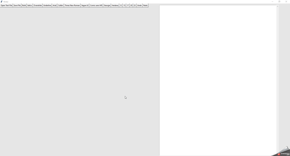

# Typewriter 🖨️
Typewriter is word processor made with Python similar to Word

## How to use it

- download [**typewriter.py**](https://github.com/ssantoshp/Pencil)
- go to the direction of typewriter.py with your command prompt
- type ```python typewriter.py``` or you can also run the typewriter.py file

## What does it look like ✨

<p align="center">
  
 </p>

## Functionalities ✏️

- Opening and saving a text file
- Bold
- Italic
- Overstrike
- Underline
- Use different fonts : Arial, Calibri, Times New Roman, Segoe UI, Comic sans MS, Georgia, Verdana
- Change the size of the font : 12, 15, 17, 20, 22
- Undo and redo actions
